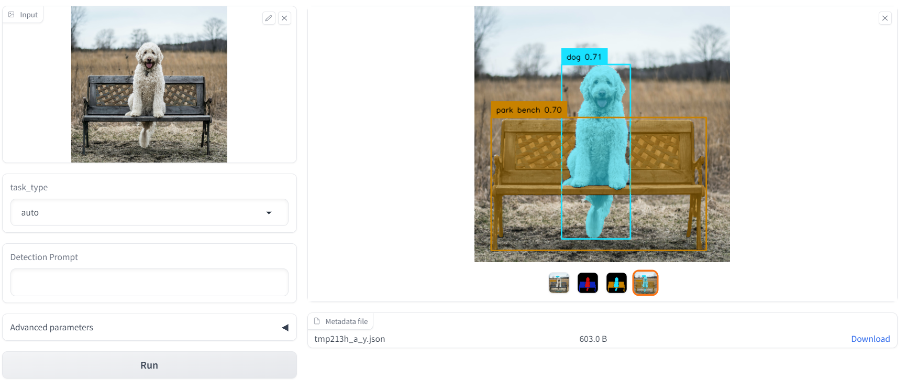
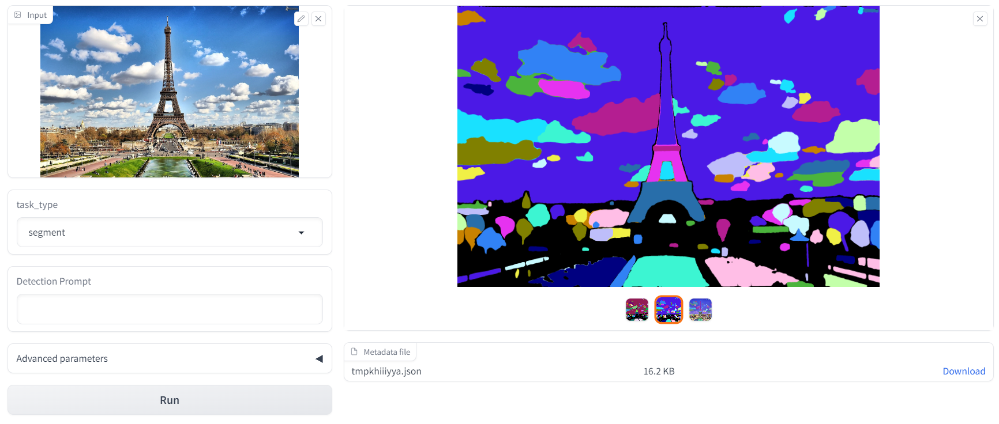
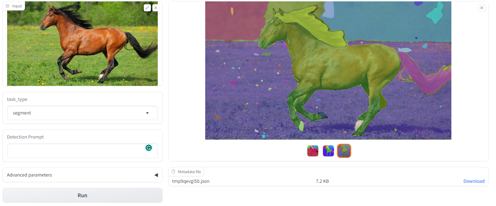

# Annotate Anything

[](https://github.com/binh234/annotate-anything/blob/main/notebooks/Annotate_Anything.ipynb)







## Install libraries

```bash
pip install -r requirements.txt
```

## Download weights

```bash
python download_weights.py
```

## Run Gradio App

```bash
gradio run app.py
```

## Command-line options

```bash
python annotate_anything.py -i examples -o outputs --task segment
```

```bash
usage: annotate-anything.py [-h] --input INPUT --output OUTPUT [--sam-type SAM_TYPE] [--sam-checkpoint SAM_CHECKPOINT] [--tag2text-checkpoint TAG2TEXT_CHECKPOINT]
                 [--dino-config DINO_CONFIG] [--dino-checkpoint DINO_CHECKPOINT] [--task {auto,detect,segment}] [--prompt PROMPT] [--box-threshold BOX_THRESHOLD]
                 [--text-threshold TEXT_THRESHOLD] [--iou-threshold IOU_THRESHOLD] [--save-mask] [--device DEVICE]

Runs automatic detection and mask generation on an input image or directory of images

optional arguments:
  -h, --help            show this help message and exit
  --input INPUT, -i INPUT
                        Path to either a single input image or folder of images.
  --output OUTPUT, -o OUTPUT
                        Path to the directory where masks will be output. Output will be either a folder of PNGs per image or a single json with COCO-style masks.
  --sam-type SAM_TYPE   The type of SA model to load, in ['default', 'vit_h', 'vit_l', 'vit_b']
  --sam-checkpoint SAM_CHECKPOINT
                        The path to the SAM checkpoint to use for mask generation.
  --tag2text-checkpoint TAG2TEXT_CHECKPOINT
                        The path to the Tag2Text checkpoint to use for tags and caption generation.
  --dino-config DINO_CONFIG
                        The config file of Grounding Dino model to load
  --dino-checkpoint DINO_CHECKPOINT
                        The path to the Grounding Dino checkpoint to use for detection.
  --task {auto,detect,segment}
                        Task to run
  --prompt PROMPT       Detection prompt
  --box-threshold BOX_THRESHOLD
                        box threshold
  --text-threshold TEXT_THRESHOLD
                        text threshold
  --iou-threshold IOU_THRESHOLD
                        iou threshold
  --save-mask           If True, save all intermidiate masks.
  --device DEVICE       The device to run generation on.
```

```bash
usage: amg.py [-h] --input INPUT --output OUTPUT --model-type MODEL_TYPE --checkpoint CHECKPOINT [--device DEVICE] [--convert-to-rle]
                 [--points-per-side POINTS_PER_SIDE] [--points-per-batch POINTS_PER_BATCH] [--pred-iou-thresh PRED_IOU_THRESH]
                 [--stability-score-thresh STABILITY_SCORE_THRESH] [--stability-score-offset STABILITY_SCORE_OFFSET] [--box-nms-thresh BOX_NMS_THRESH]
                 [--crop-n-layers CROP_N_LAYERS] [--crop-nms-thresh CROP_NMS_THRESH] [--crop-overlap-ratio CROP_OVERLAP_RATIO]
                 [--crop-n-points-downscale-factor CROP_N_POINTS_DOWNSCALE_FACTOR] [--min-mask-region-area MIN_MASK_REGION_AREA]

Runs automatic mask generation on an input image or directory of images, and outputs masks as either PNGs or COCO-style RLEs. Requires open-cv, as well as pycocotools if saving in RLE format.

optional arguments:
  -h, --help            show this help message and exit
  --input INPUT, -i INPUT
                        Path to either a single input image or folder of images.
  --output OUTPUT, -o OUTPUT
                        Path to the directory where masks will be output. Output will be either a folder of PNGs per image or a single json with COCO-style masks.
  --model-type MODEL_TYPE
                        The type of model to load, in ['default', 'vit_h', 'vit_l', 'vit_b']
  --checkpoint CHECKPOINT
                        The path to the SAM checkpoint to use for mask generation.
  --device DEVICE       The device to run generation on.
  --convert-to-rle      Save masks as COCO RLEs in a single json instead of as a folder of PNGs. Requires pycocotools.

AMG Settings:
  --points-per-side POINTS_PER_SIDE
                        Generate masks by sampling a grid over the image with this many points to a side.
  --points-per-batch POINTS_PER_BATCH
                        How many input points to process simultaneously in one batch.
  --pred-iou-thresh PRED_IOU_THRESH
                        Exclude masks with a predicted score from the model that is lower than this threshold.
  --stability-score-thresh STABILITY_SCORE_THRESH
                        Exclude masks with a stability score lower than this threshold.
  --stability-score-offset STABILITY_SCORE_OFFSET
                        Larger values perturb the mask more when measuring stability score.
  --box-nms-thresh BOX_NMS_THRESH
                        The overlap threshold for excluding a duplicate mask.
  --crop-n-layers CROP_N_LAYERS
                        If >0, mask generation is run on smaller crops of the image to generate more masks. The value sets how many different scales to crop at.
  --crop-nms-thresh CROP_NMS_THRESH
                        The overlap threshold for excluding duplicate masks across different crops.
  --crop-overlap-ratio CROP_OVERLAP_RATIO
                        Larger numbers mean image crops will overlap more.
  --crop-n-points-downscale-factor CROP_N_POINTS_DOWNSCALE_FACTOR
                        The number of points-per-side in each layer of crop is reduced by this factor.
  --min-mask-region-area MIN_MASK_REGION_AREA
                        Disconnected mask regions or holes with area smaller than this value in pixels are removed by postprocessing.
```

## References

[Segment Anything](https://github.com/facebookresearch/segment-anything)
[Grounding DINO](https://github.com/IDEA-Research/GroundingDINO)
[Tag2Text](https://github.com/xinyu1205/Tag2Text)
[Grounded SAM](https://github.com/IDEA-Research/Grounded-Segment-Anything)
